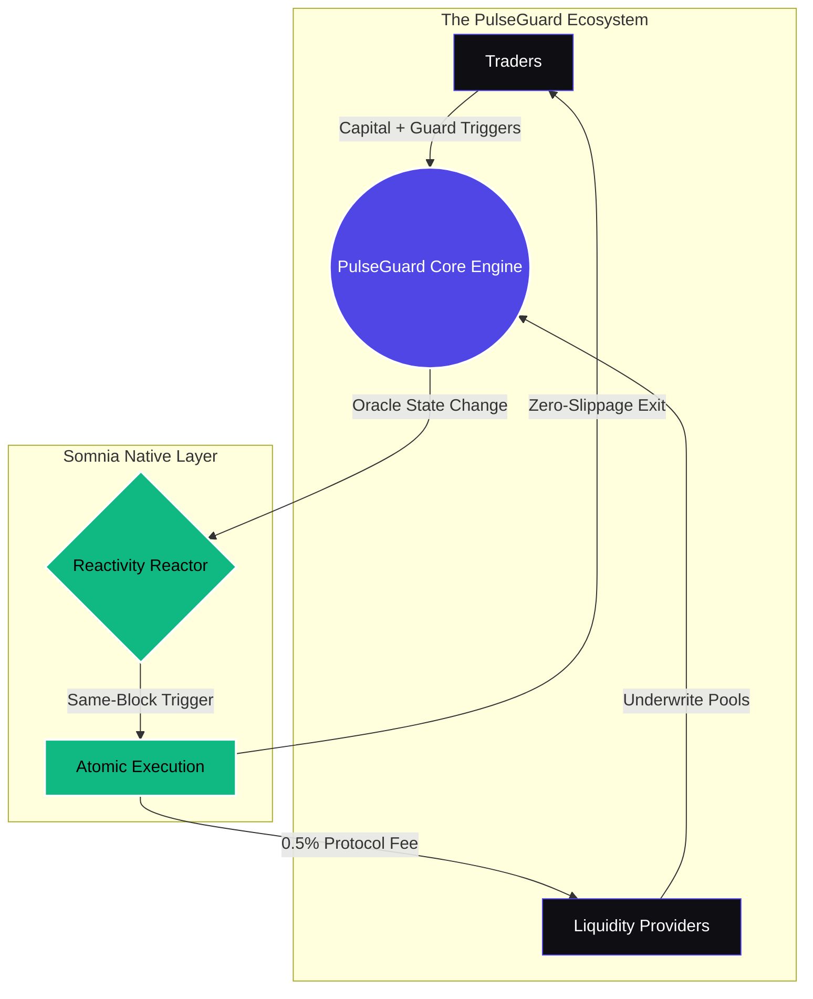

<div align="center">
  

  <h1>🛡️ PulseGuard Protocol</h1>
  <p><strong>The World's First Reactive Liquidity Protocol & Prediction Market</strong></p>
  
  [](https://pulseguard-eight.vercel.app/)
  [](https://somnia.network/)
  [](https://somnia-testnet.socialscan.io/address/0x1850d2a31CB8669Ba757159B638DE19Af532ba5e)
  [](https://opensource.org/licenses/MIT)

  <br />
  <p>
    <a href="#-the-problem--solution">Vision</a> •
    <a href="#-core-primitives">Features</a> •
    <a href="#-architecture">Architecture</a> •
    <a href="#-getting-started">Quick Start</a> •
    <a href="#-roadmap">Roadmap</a>
  </p>
</div>

---

## 🛑 The Problem & Solution

**Prediction markets force traders to take on massive volatility risk.** On traditional EVM networks, risk management (like a Stop-Loss) requires slow keeper bots, Chainlink Automation subscriptions, and inherently suffers from multi-block delays. This creates massive MEV vulnerabilities and catastrophic slippage.

**PulseGuard solves this using Somnia's Native Reactivity.** Our platform executes risk triggers (Stop-Loss/Take-Profit) within the *exact same block* as the price update. Execution is an atomic, reactive consequence of the blockchain itself. Zero keeper bots. Zero race conditions. Zero slippage.

---

## ✨ Core Primitives

### 1. Guard Mode (Reactive Risk Management)
Traders can set precise downside limits before entering a pool. Powered by Somnia, these triggers fire instantly without relying on third-party automation infrastructure. 

### 2. The LP Hub (Yield-Bearing Provisioning)
PulseGuard is a two-sided AMM. Anyone can act as a Market Maker by seeding `STT` into the YES or NO pools. LPs underwrite the traders and earn a **0.5% royalty** on every trade, transforming prediction markets into yield-generating assets.

### 3. Permissionless Scaling (On-Chain Registry)
A fully decentralized market creation engine. For any user-created market (ID > 40), the frontend bypasses local storage and dynamically reads the metadata directly from the Somnia ledger. Infinite scaling, zero bottlenecks.

---

## 🏗 Architecture



---

## 💻 Technical Stack

* **Smart Contracts:** Solidity (Deployed on Somnia Testnet)
* **Frontend:** Next.js 14 (App Router), React, TypeScript
* **Styling:** Tailwind CSS v4, Lucide React, Recharts
* **Web3 Integration:** Wagmi, Viem
* **Deployment:** Vercel Production Build

---

## 📂 Project Structure

```text
pulseguard/
├── frontend/
│   ├── src/
│   │   ├── app/           # Next.js App Router (Pages & Layouts)
│   │   ├── components/    # Reusable UI (BetForm, SquadBoard, etc.)
│   │   ├── lib/           # Web3 Configs, Constants, and Utils
│   │   └── styles/        # Global CSS and Tailwind config
│   ├── public/            # Static assets
│   └── package.json
└── README.md
```

---

## 🏁 Getting Started

### Prerequisites
* Node.js (v18 or higher)
* Git
* A Web3 Wallet (MetaMask, Rabby) configured for the Somnia Testnet

### Installation

1. **Clone the repository:**
   ```bash
   git clone https://github.com/Vinaystwt/pulseguard.git
   cd pulseguard/frontend
   ```

2. **Install dependencies:**
   ```bash
   npm install
   ```

3. **Set up Environment Variables:**
   Create a `.env.local` file in the `frontend` directory (if required for custom RPCs):
   ```env
   NEXT_PUBLIC_SOMNIA_RPC_URL=https://dream-rpc.somnia.network/
   NEXT_PUBLIC_CONTRACT_ADDRESS=0x1850d2a31CB8669Ba757159B638DE19Af532ba5e
   ```

4. **Run the development server:**
   ```bash
   npm run dev
   ```
   Navigate to `http://localhost:3000` to interact with the protocol locally.

---

## 🗺 Roadmap

- [x] MVP Deployment on Somnia Testnet
- [x] Atomic Guard Mode Integration
- [x] 0.5% LP Royalty Implementation
- [ ] Dynamic AMM Bonding Curves
- [ ] Multi-Asset Collateral Support (USDC, wETH)
- [ ] Decentralized Identity Integration for Pulse Scores
- [ ] Somnia Mainnet Deployment

---

## 🧠 The Architect

**Built solo by Vinay.** Designed and engineered by a full-stack generalist and DeFi architect specializing in rapid prototyping, high-fidelity interfaces, and building next-generation Web3 infrastructure.

<div align="center">
  <p><i>Built for the <strong>Somnia Reactivity Hackathon</strong></i></p>
</div>
